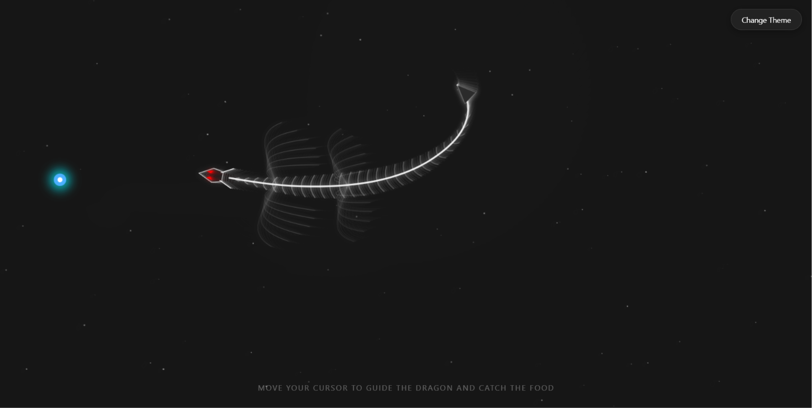
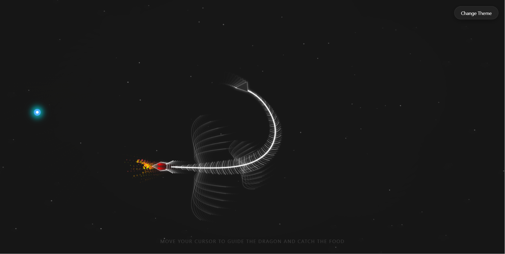

# Skeletal Dragon — Snake Mover

Yeh chhota project ek procedural "Skeletal Dragon" animation/game hai — mouse/touch se guide karke food khana hai. Yeh README Hindi mein hai aur simple deploy/run instructions, live link example, aur screenshots include karta hai.

## Live demo
- Local (open in browser): [https://skeletal-dragon-animation.onrender.com]
- GitHub Pages example format: `https://<your-username>.github.io/<repo-name>/`

## Screenshots





## Controls / Usage
- Move cursor / touch screen: Dragon head ko guide karega.
- Double-click (desktop) ya double-tap (mobile): Fire breathe trigger karega.
- `Change Theme` button: Background theme cycle karega.

## Files
- `index.html` — HTML canvas aur button.
- `script.js` — Engine: particle pool, `SkeletonDragon`, `Food`, input bindings, aur main loop.
- `style.css` — Canvas aur UI styling.
- `assets/images/` — Included two SVG screenshots.

## How to run locally
1. Simple: double-click `index.html` to open in your browser.
2. Better (recommended): run a local static server for consistent behavior:

```bash
npx http-server -c-1 .
# or
npx serve .
```

Then open `http://localhost:8080` (port may vary).

## Deploy to GitHub Pages (quick)
1. Push your repo to GitHub.
2. In repository settings -> Pages, set branch to `main` (or `gh-pages`) and folder `/ (root)`.
3. After publish, visit `https://<your-username>.github.io/<repo-name>/`.

## Notes / Credits
- Engine optimized with object pooling, squared-distance checks, and batched rendering.
- Author: you (edit README to add your name).

---

If you want, I can: deploy this repo to GitHub Pages for you (I can create the gh-pages branch and instructions), or generate PNG screenshots instead of SVGs. Bataya toh batao.